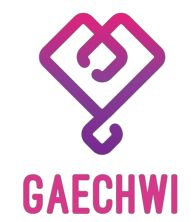
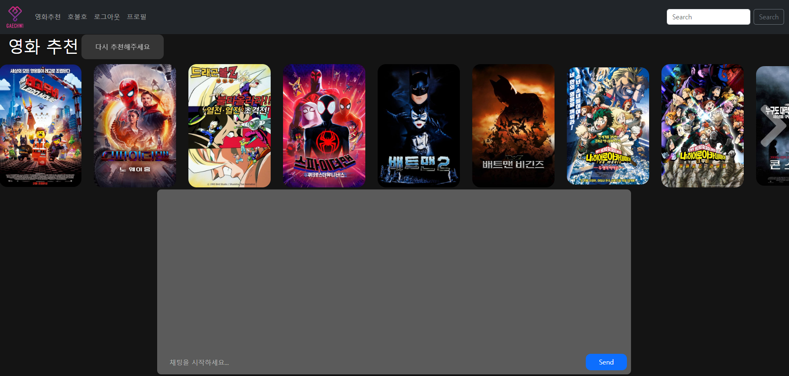
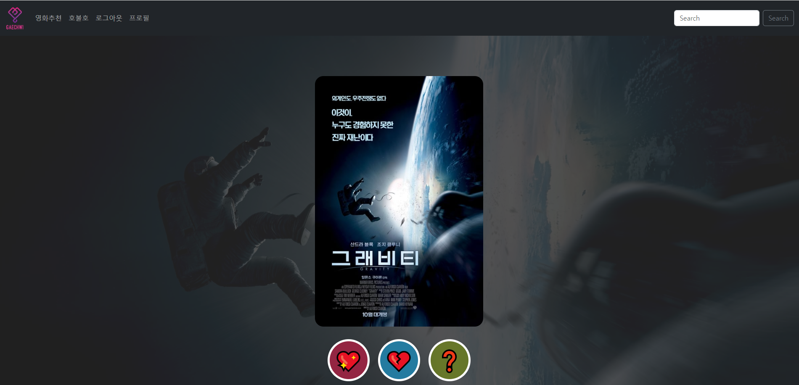
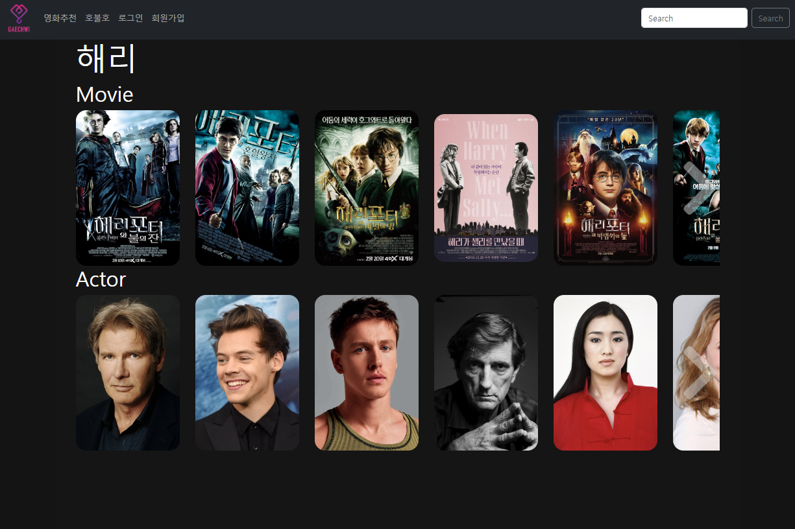
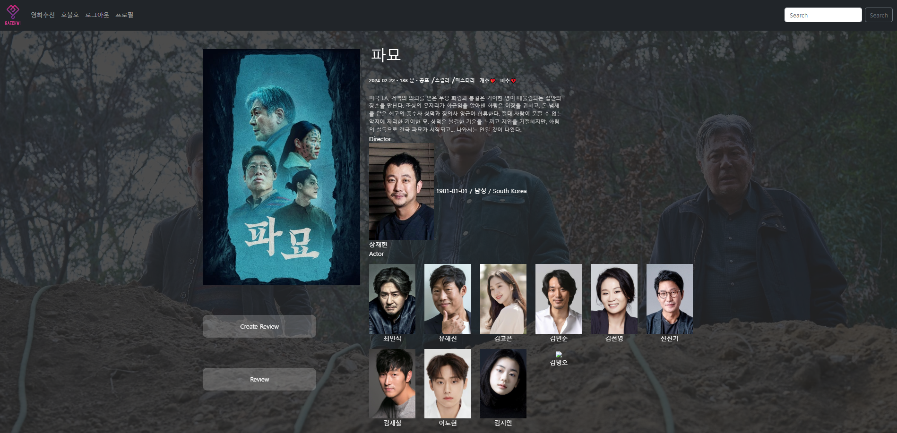
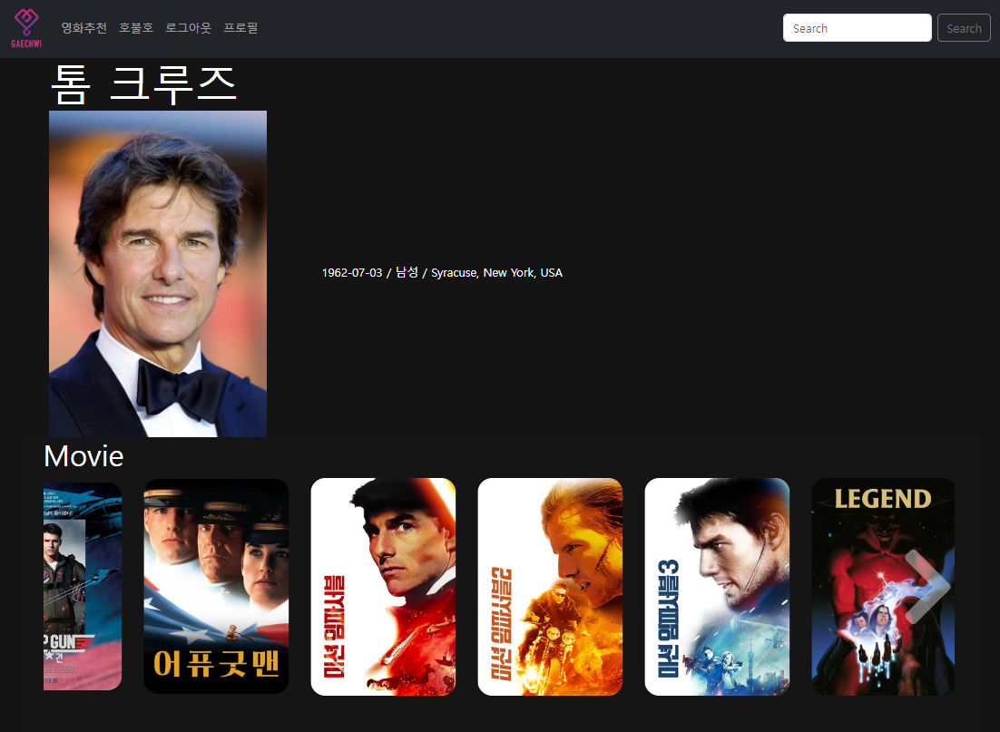
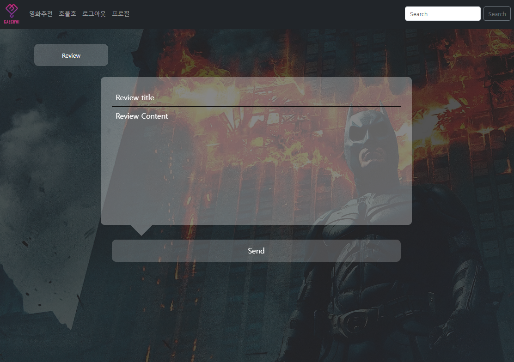
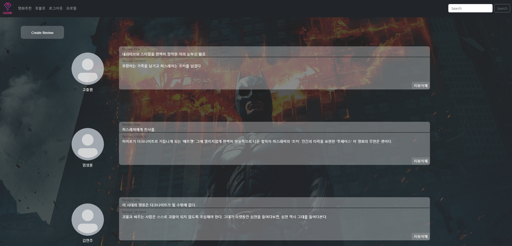
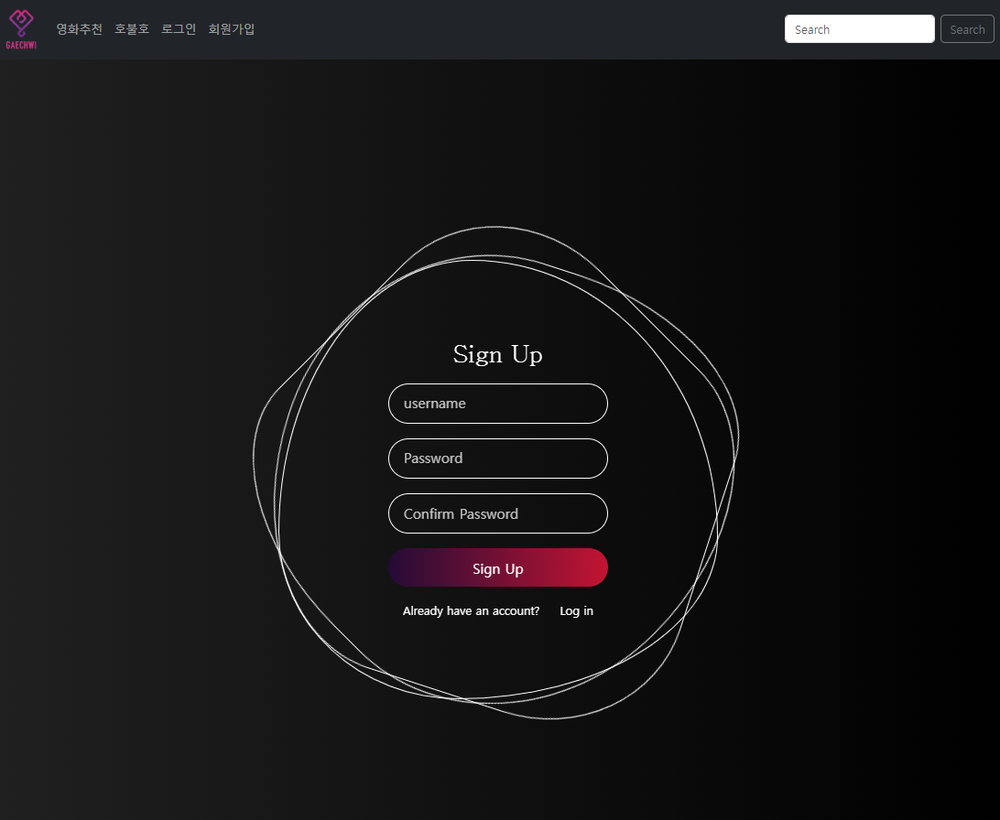
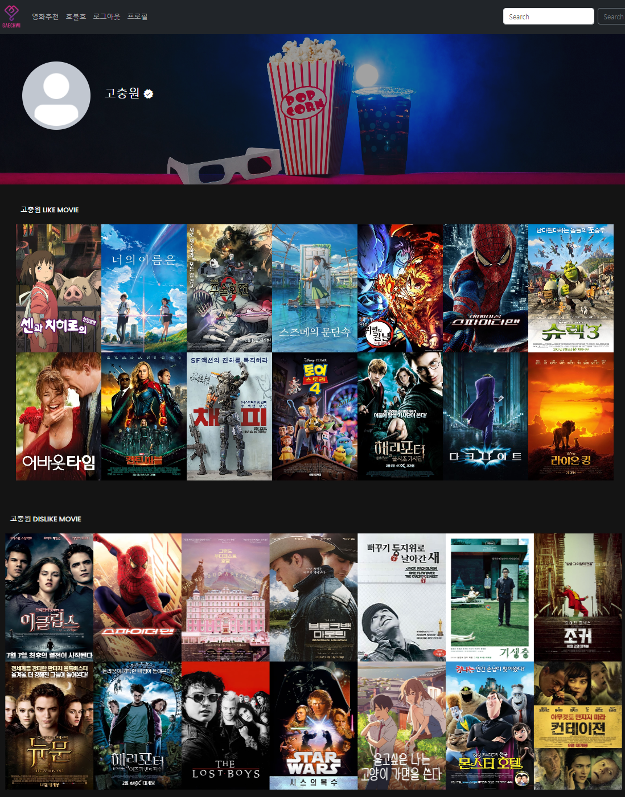

#  개취무비

## 📚 목차

1. [프로젝트 개요](#-프로젝트-개요)

2. [팀](#-팀)
   
3. [서비스 소개](#-서비스-소개)
  
    1. [서비스 기획 목표](#서비스-기획-목표)
   
    2. [ERD](#ERD)
   
    3. [WireFrame](#WireFrame)

    4. [영화 추천 알고리즘](#영화-추천-알고리즘)

    5. [구현 기능](#구현-기능)
   
4. [설치 및 실행](#-설치-및-실행)
   
5. [오픈소스 출처](#-오픈소스-출처)
   
6. [느낀점](#-느낀점)


## 🗓️프로젝트 개요

### 진행 기간
2023.05.16 ~ 2022.05.24 오전 9시 (9일간)

### 기술 스택


  


## 👯팀원 정보 및 업무 분담 내역

고충원 - 화면 설계서 제작 및 컴포넌트 설계, OST, 영화 명대사 데이터 수집 및 정제, Front-END 개발 및 UI, UX 개선

임성훈 - 영화 데이터 수집 및 정제, 추천 알고리즘 개발, ERD 설계, DB 구출 및 Back-End 개발

## 서비스 소개

### 서비스 기획 목표

사용자가 자신의 취향에 맞는 영화를 찾는데 시간을 아낄 수 있도록 영화 추천

### ERD


### Figma


### 📹시연 영상(유튜브 링크)


## 서비스 구현


### 영화 추천 알고리즘

영화마다 가지고 있는 키워드들이 있고 그 키워드 모델과 유저 모델을 관계 맺어, 

```
@api_view(['POST'])
def like_movie(request, movie_pk):
    user = request.user
    movie = get_object_or_404(Movie, pk=movie_pk)
    # 좋아요가 눌러져 있을 때
    if movie.like_users.filter(pk=user.pk).exists():
        movie.like_users.remove(user)
        # 키워드-1
        remove_user_keywords(user, movie)
        serializer = MovieSerializer(movie)
        return Response(serializer.data)
    # 좋아요 안 눌러져 있을 때
    else:
        if movie.dislike_users.filter(pk=user.pk).exists():
            movie.dislike_users.remove(user)
            # 싫어요 취소 되니까 키워드+1
            add_user_keywords(user, movie)
        # 키워드 +1
        movie.like_users.add(user)
        add_user_keywords(user, movie)
        serializer = MovieSerializer(movie)
        return Response(serializer.data)
```

### 홈 화면


###  영화 추천


### 챗봇


### 랜덤 추천

### 영화 검색 페이지

### 영화 디테일 페이지

### 배우 디테일 페이지

### 리뷰 생성 

### 리뷰 페이지


### login/signup



### 프로필



## 🎯  필수 요구 사항
- 구현성공 ⭕
- 구현실패 ❌
- 필수 요구사항 ✅
- 추가로 구현 한 기능 💖

1. 영화 데이터 ⭕ ✅
  -  영화 정보 데이터는 최소 50개 이상 존재해야 함
  - fixtures를 사용하여 언제든 load 될 수 있는 초기 데이터가 있어야 함
2. 영화 추천 알고리즘 ⭕ ✅
  - 사용자는 반드시 최소 1개 이상의 영화를 추천 받을 수 있어야 함
  - 추천 방식은 자유롭게 구성 가능
  - 어떠한 방식으로 추천 시스템을 구현했는지 기술적으로 설명할 수 있어야 함
3. API ⭕ ✅
  - API 사용 제한 없음 (TMDB, Youtube API 등)
4. 커뮤니티 ⭕ ✅
  - 유저간 소통 할 수 있는 커뮤니티 기능을 구현
  - 커뮤니티 기능은 반드시 게시판 형식일 필요는 없으며,
    소통이라는 관점 안에서 다양한 아이디어로 자유롭게 구현 가능

5. README ⭕ ✅
     1. 팀원 정보 및 업무 분담 내역
     2. 목표 서비스 구현 및 실제 구현 정도
     3. 데이터베이스 모델링 (ERD)
     4. 영화 추천 알고리즘에 대한 기술적 설명
     5. 핵심 기능에 대한 설명
     6. 기타 (느낀점, 후기 등)
     7.  배포 서버 URL (배포했을 경우)
     - ❖ 이 외의 내용은 자유롭게 작성 가능


## 👍 느낀 점

임성훈 - 

고충원 - 