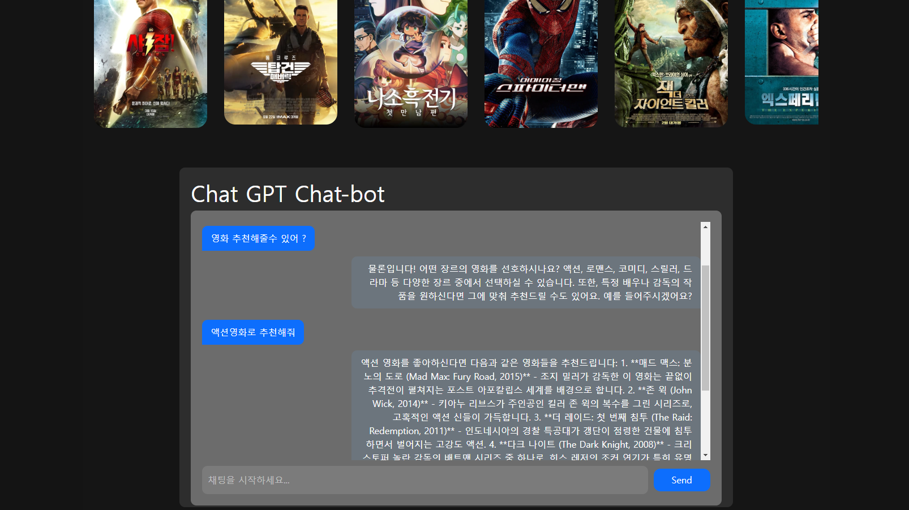

#  개취무비

## 📚 목차

1. [프로젝트 개요](#-🗓️프로젝트-개요)

2. [팀](#-👯‍♀️팀원-정보-및-업무-분담-내역)
   
3. [서비스 소개](#-📢서비스-소개)
  
    1. [서비스 기획 목표](#서비스-기획-목표)
   
    2. [ERD](#ERD)
   
    3. [WireFrame](#WireFrame)

    4. [영화 추천 알고리즘](#영화-추천-알고리즘)
   
4. [기능 구현/ 요구사항](#💻기능-구현-요구사항)
    1. [구현 화면](#홈-화면)
    2. [요구 사항](#🎯-요구-사항--기능구현) 

5. [느낀점](#👍-느낀-점)
   
6. [오픈소스 출처](#📁-오픈소스-출처)
   


## 🗓️프로젝트 개요

### 진행 기간
2023.05.16 ~ 2022.05.24 오전 9시 (9일간)

### 기술 스택


  


## 👯‍♀️팀원 정보 및 업무 분담 내역

고충원 - 화면 설계서 제작 및 컴포넌트 설계, OST, 영화 명대사 데이터 수집 및 정제, Front-END 개발 및 UI, UX 개선

임성훈 - 영화 데이터 수집 및 정제, 추천 알고리즘 개발, ERD 설계, DB 구출 및 Back-End 개발

## 📢서비스 소개

### 서비스 기획 목표

사용자가 자신의 취향에 맞는 영화를 찾는데 시간을 아낄 수 있도록 영화 추천

### ERD


### Wireframe

#### Figma


### 영화 추천 알고리즘

영화마다 가지고 있는 키워드들이 있고 그 키워드 모델과 유저 모델을 관계 맺어, count필드가 들어 있는 Userkeyword모델을 생성합니다.

그 후 좋아요 누른 영화의 키워드마다 +1,
싫어요 누른 영화의 키워드마다 -1을 합니다.

```
# 좋아요 누르기
@api_view(['POST'])
def like_movie(request, movie_pk):
    user = request.user
    movie = get_object_or_404(Movie, pk=movie_pk)
    # 좋아요가 눌러져 있을 때
    if movie.like_users.filter(pk=user.pk).exists():
        movie.like_users.remove(user)
        # 키워드-1
        remove_user_keywords(user, movie)
        serializer = MovieSerializer(movie)
        return Response(serializer.data)
    # 좋아요 안 눌러져 있을 때
    else:
        if movie.dislike_users.filter(pk=user.pk).exists():
            movie.dislike_users.remove(user)
            # 싫어요 취소 되니까 키워드+1
            add_user_keywords(user, movie)
        movie.like_users.add(user)
        # 키워드 +1
        add_user_keywords(user, movie)
        serializer = MovieSerializer(movie)
        return Response(serializer.data)
```
 - 싫어요 누르는 함수도 위와 똑같으니 생략

```
# 키워드 + 1
def add_user_keywords(user, movie):
    # id를 받기 위해 values_list 사용
    keyword_ids = movie.keywords.values_list('id', flat=True)
    for keyword_id in keyword_ids:
        # 필드에 키워드가 없으면 생성
        user_keyword, created = UserKeyword.objects.get_or_create(user=user, keyword_id=keyword_id)
        # 카운트
        user_keyword.count += 1
        user_keyword.save()
    return
```
- 키워드 -1 함수도 위와 똑같으니 생략

count가 0보다 큰 키워드들만 추출해서 단순히 좋아하는 keyword의 개수가 아닌 내가 좋아요 누른 count의 합을 기준으로 데이터를 뽑아왔습니다.
```
# 영화 추천 알고리즘
@api_view(['GET'])
def recommended(request, user_pk, page_pk):
    # count가 0보다 큰 keywords를 추출
    user_keywords = UserKeyword.objects.filter(user_id=user_pk, count__gt=0)
    
    # keywords id 리스트 생성
    keyword_ids = user_keywords.values_list('keyword_id', flat=True)

    # 사용자가 좋아요한 영화 제외하고, 각 키워드의 count 합을 기준으로 큰 순서부터 정렬
    recommended_movies = Movie.objects.filter(
        keywords__in=keyword_ids
    ).exclude(
        like_users__id=user_pk
    ).annotate(
        keyword_match_count=Sum(
            Case(
                *[
                    When(keywords=keyword_id, then=user_keyword.count) 
                    for keyword_id, user_keyword in zip(keyword_ids, user_keywords)
                ],
                default=0,
                output_field=IntegerField()
            )
        )
    ).order_by('-keyword_match_count').distinct()
    
    # 한 페이지당 10개의 데이터 저장
    paginator = Paginator(recommended_movies, 10)
    
    page = request.GET.get('page', page_pk)
    page_movies = paginator.get_page(page)
    serializer = MovieSerializer(page_movies, many=True)
    
    return Response(serializer.data)
```

## 💻기능 구현/ 요구사항

### 홈 화면


### 영화 검색 페이지

### 영화 디테일 페이지

### 배우 디테일 페이지

### 리뷰 생성 

### 리뷰 페이지


### 랜덤 추천

###  영화 추천

### 챗봇


### signup/login


### 프로필


### 🎯 요구 사항
- 구현성공 ⭕
- 구현실패 ❌
- 필수 요구사항 ✅
- 추가로 구현 한 기능 💖


1. 영화 데이터 ⭕ ✅
2. 영화 추천 알고리즘 ⭕ ✅
3. API ⭕ ✅
4. 커뮤니티 ⭕ ✅
5. README ⭕ ✅
6. Ai Chat bot 기능 ⭕💖
7. Ai 기반 Chat GPT 가 해주는 영화 추천 ⭕💖
8. 영화 검색 알고리즘 ⭕💖
9. 랜덤 영화 추천 알고리즘 ⭕💖

## 👍 느낀 점

임성훈 - 

고충원 - 

## 📁 오픈소스 출처

- TMDB : https://developer.themoviedb.org/reference/intro/getting-started 
- GPT : https://openai.com/index/openai-api/